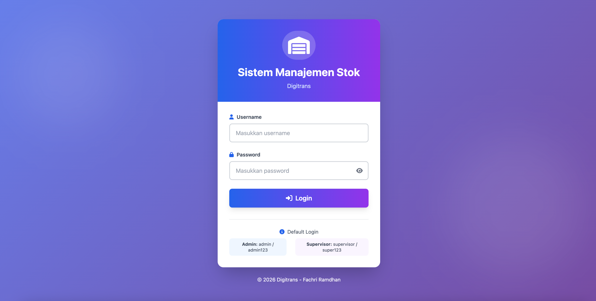
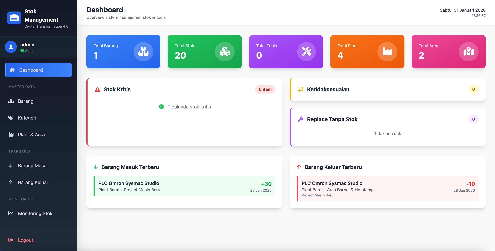
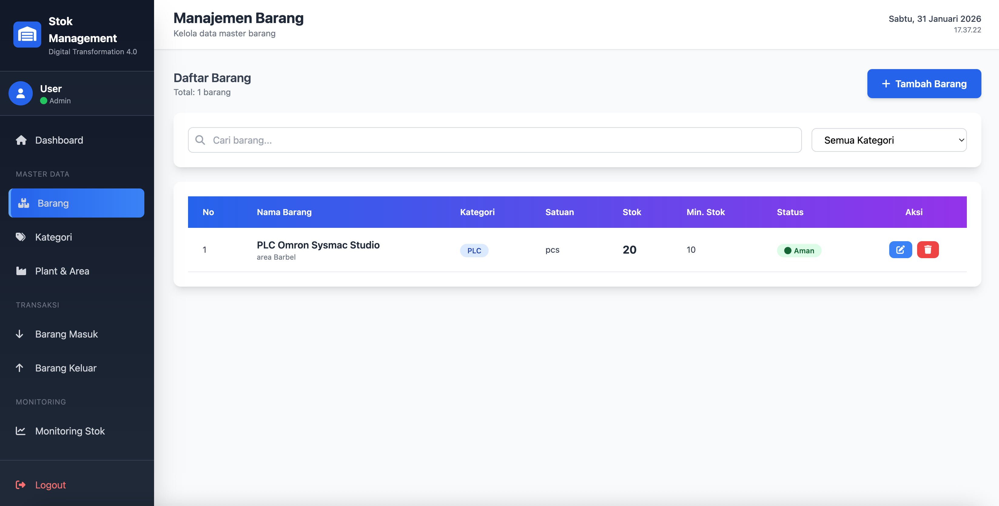
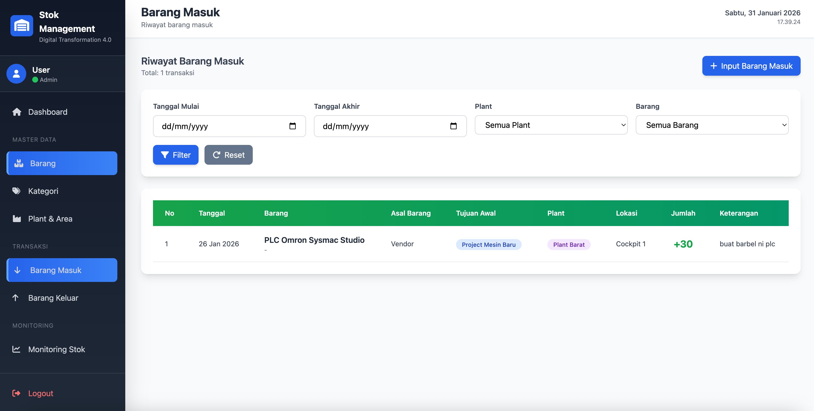
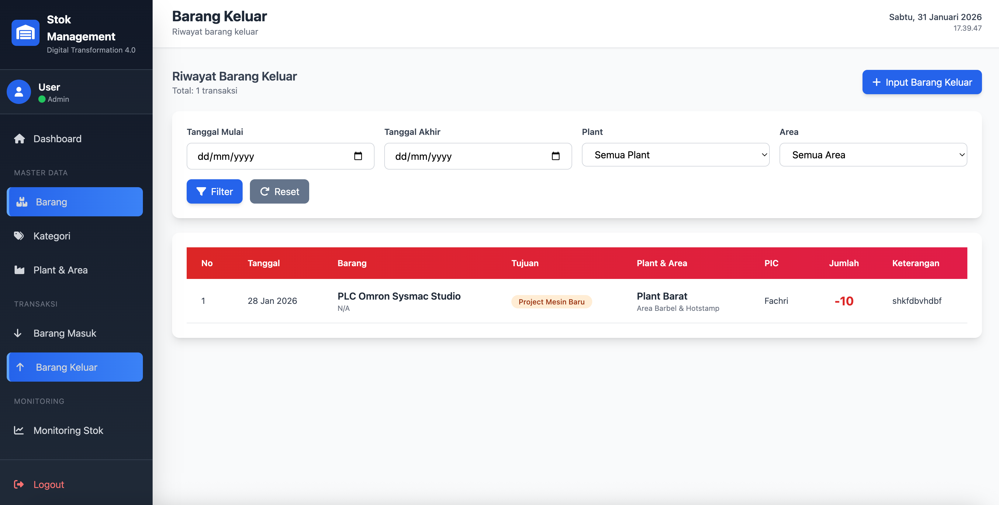
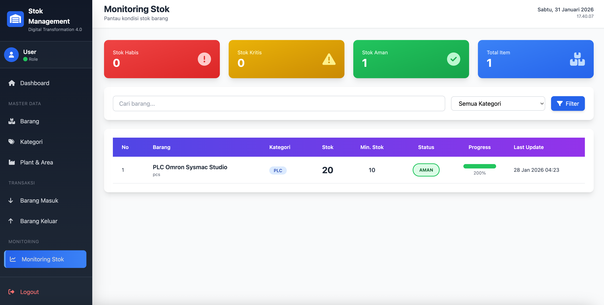
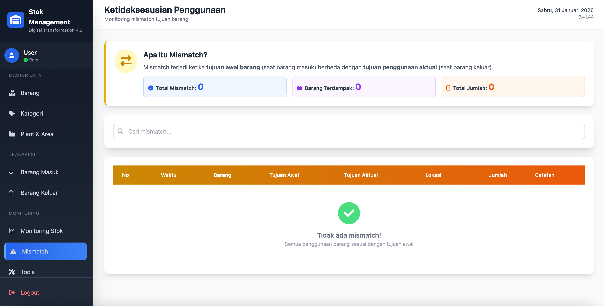
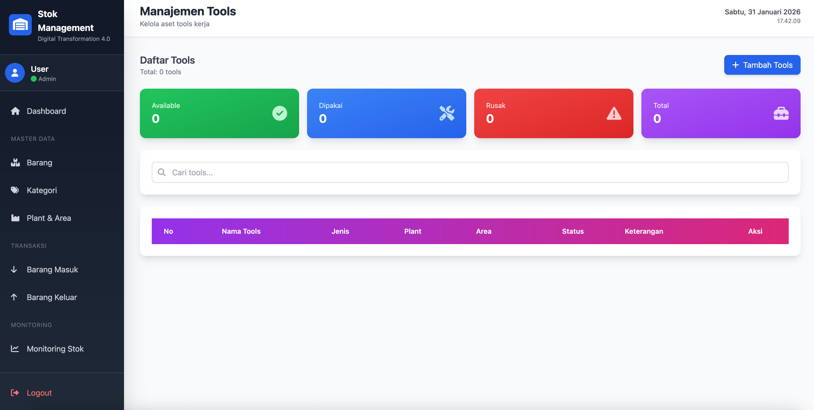

# 📦 Sistem Manajemen Stok & Tools - Digitrans Manufacturing

<div align="center">


[Demo](#demo) • [Fitur](#-fitur-utama) • [Instalasi](#-instalasi) • [Dokumentasi](#-dokumentasi)

</div>

---

## 📋 Daftar Isi

- [Tentang Proyek](#-tentang-proyek)
- [Fitur Utama](#-fitur-utama)
- [Teknologi](#-teknologi-yang-digunakan)
- [Arsitektur Sistem](#-arsitektur-sistem)
- [Instalasi](#-instalasi)
- [Konfigurasi](#-konfigurasi)
- [Penggunaan](#-penggunaan)
- [Screenshot](#-screenshot)
- [Database Schema](#-database-schema)
- [API Documentation](#-api-documentation)
- [Roadmap](#-roadmap)
- [Contributing](#-contributing)
- [License](#-license)
- [Kontak](#-kontak)

---

## 🎯 Tentang Proyek

Sistem Manajemen Stok & Tools adalah aplikasi web berbasis ASP.NET Core yang dirancang khusus untuk **Tim Digital Transformation 4.0** dalam mengelola stok barang otomasi & IoT serta tools kerja di lingkungan manufaktur.

### 🏭 Latar Belakang

Proyek ini dikembangkan untuk mengatasi tantangan dalam pengelolaan:

- **5 Area Produksi** berbeda
- **3 Plant** (Timur, Barat, Utara)
- **Stok Barang** otomasi & IoT
- **Tools Kerja** lapangan
- **Kebutuhan Project & Replace**

### 🎪 Masalah yang Diselesaikan

Sebelum sistem ini:

- ❌ Data tidak terdokumentasi rapi
- ❌ Sulit tracking lintas plant & area
- ❌ Salah penggunaan barang (project ↔️ replace)
- ❌ Kehabisan stok saat dibutuhkan

Setelah menggunakan sistem:

- ✅ Data terstruktur dan real-time
- ✅ Tracking lengkap semua transaksi
- ✅ Deteksi mismatch otomatis
- ✅ Warning stok kritis
- ✅ Laporan komprehensif

---

## ⚡ Fitur Utama

### 🔐 1. Authentication & Authorization

- **Role-based Access Control** (Admin & Supervisor)
- Session management yang aman
- Password hashing dengan BCrypt

### 📦 2. Manajemen Master Data

- **Kategori Barang** - Kelompokkan barang berdasarkan jenis
- **Master Barang** - CRUD lengkap dengan tracking stok
- **Plant & Area** - Manajemen lokasi produksi
- **Tools** - Tracking aset tools kerja

### 📊 3. Transaksi Stok

- **Barang Masuk** - Auto increment stok
- **Barang Keluar** - Auto decrement dengan validasi stok
- **Validasi Stok Real-time** - Cegah stok negatif
- **History Lengkap** - Track semua pergerakan barang

### 🎯 4. Monitoring & Analytics

- **Dashboard Interaktif** - Real-time statistics
- **Monitoring Stok** - Visual status (Aman/Kritis/Habis)
- **Deteksi Mismatch** - Otomatis detect ketidaksesuaian
- **Warning System** - Alert stok kritis
- **Replace Tracking** - Monitor kebutuhan replace tanpa stok

### 📈 5. Reporting

- Filter berdasarkan tanggal, plant, area, barang
- Export data (coming soon)
- Visual charts dan graphs

---

## 🛠 Teknologi yang Digunakan

### Backend

- **ASP.NET Core 8.0** - Web framework
- **Entity Framework Core** - ORM
- **MySQL 8.0** - Database
- **BCrypt.NET** - Password hashing

### Frontend

- **Tailwind CSS 3.x** - Utility-first CSS framework
- **Font Awesome 6.4** - Icons
- **jQuery 3.7** - DOM manipulation
- **Vanilla JavaScript** - Interactive features

### Development Tools

- **Visual Studio Code** - Code editor
- **MAMP** - Local MySQL server
- **Git** - Version control

---

# 🏗 System Architecture

Arsitektur sistem ini menggunakan **Layered Architecture** untuk menjaga struktur kode tetap rapi, mudah dikembangkan, dan scalable.

---

## 📐 Architecture Diagram

```mermaid
flowchart LR

    %% ===== ROW 1 =====
    subgraph PL[Presentation Layer]
        direction LR
        V[Views - cshtml]
        L[Layouts]
        P[Partials]
        A[Assets - CSS JS]

        V --> L --> P --> A
    end

    subgraph BL[Business Logic Layer]
        direction LR
        C[Controllers]
        S[Services]
        H[Helpers]
        F[Filters]

        C --> S --> H --> F
    end

    %% ===== ROW 2 =====
    subgraph DAL[Data Access Layer]
        direction LR
        M[Models]
        D[DbContext]
        R[Repository]
        DB[(MySQL 8.0)]

        M --> D --> R --> DB
    end

    %% ===== CONNECTION =====
    A --> C
    F --> M

    %% ===== STYLING =====
    style PL fill:#e3f2fd,stroke:#1e88e5,stroke-width:2px
    style BL fill:#e8f5e9,stroke:#43a047,stroke-width:2px
    style DAL fill:#fff3e0,stroke:#fb8c00,stroke-width:2px
    style DB fill:#fdecea,stroke:#e53935,stroke-width:2px
```



---

### Design Pattern

- **MVC (Model-View-Controller)** - Separation of concerns
- **Repository Pattern** - Data access abstraction
- **Dependency Injection** - Loose coupling
- **Session Management** - State management

---

## 🚀 Instalasi

### Prerequisites

Pastikan sudah terinstall:

- [.NET SDK 8.0](https://dotnet.microsoft.com/download)
- [Node.js & npm](https://nodejs.org/)
- [MAMP](https://www.mamp.info/) atau MySQL Server
- [Git](https://git-scm.com/)

### Step-by-Step Installation

#### 1. Clone Repository

```bash
git clone https://github.com/username/stok-management-system.git
cd stok-management-system/StokApp
```

#### 2. Install Dependencies

```bash
# Install .NET packages
dotnet restore

# Install npm packages untuk Tailwind CSS
npm install
```

#### 3. Setup Database

**A. Start MAMP/MySQL Server**

- Jalankan MAMP
- Klik "Start Servers"
- Pastikan MySQL berjalan di port **8889**

**B. Buat Database**

```sql
CREATE DATABASE stok_management CHARACTER SET utf8mb4 COLLATE utf8mb4_unicode_ci;
```

#### 4. Konfigurasi Connection String

Edit file `appsettings.json`:

```json
{
  "ConnectionStrings": {
    "DefaultConnection": "Server=localhost;Port=8889;Database=stok_management;User=root;Password=root;"
  }
}
```

> **Note:** Sesuaikan port dan credentials dengan setup MySQL Anda

#### 5. Jalankan Migration

```bash
dotnet ef migrations add InitialCreate
dotnet ef database update
```

#### 6. Build Tailwind CSS

```bash
npm run build:css
```

#### 7. Run Aplikasi

```bash
# Development mode dengan hot reload
dotnet watch run

# Atau tanpa hot reload
dotnet run
```

#### 8. Akses Aplikasi

Buka browser dan akses:

```
http://localhost:5183
```

### Default Login Credentials

**Admin:**

- Username: `admin`
- Password: `admin123`

**Supervisor:**

- Username: `supervisor`
- Password: `super123`

---

## ⚙️ Konfigurasi

### Environment Variables

Buat file `appsettings.Development.json` untuk development:

```json
{
  "ConnectionStrings": {
    "DefaultConnection": "Server=localhost;Port=8889;Database=stok_management;User=root;Password=root;"
  },
  "Logging": {
    "LogLevel": {
      "Default": "Information",
      "Microsoft.AspNetCore": "Warning",
      "Microsoft.EntityFrameworkCore": "Information"
    }
  }
}
```

### Database Configuration

**Port Settings:**

- MAMP Default: `8889`
- Standard MySQL: `3306`

**Character Set:** `utf8mb4` untuk support emoji dan karakter internasional

### Session Configuration

Di `Program.cs`:

```csharp
builder.Services.AddSession(options =>
{
    options.IdleTimeout = TimeSpan.FromHours(2);
    options.Cookie.HttpOnly = true;
    options.Cookie.IsEssential = true;
});
```

---

## 📖 Penggunaan

### 1. Login ke Sistem

1. Akses `http://localhost:5183`
2. Masukkan credentials
3. Sistem akan redirect ke Dashboard

### 2. Setup Data Master

#### Urutan Input Data (PENTING):

```
1. Kategori     → Tidak butuh data lain
2. Plant & Area → Plant sudah ada (seed data)
3. Barang       → Butuh Kategori
4. Barang Masuk → Butuh Barang, Plant
5. Barang Keluar→ Butuh Barang, Plant, Area
6. Tools        → Butuh Plant (Area opsional)
```

### 3. Workflow Transaksi

#### A. Input Barang Masuk (Tambah Stok)

```
Menu → Barang Masuk → Input Barang Masuk
↓
Isi Form:
- Barang: [Pilih dari dropdown]
- Asal Barang: Pembelian/Vendor/Transfer
- Tujuan Awal: Spare/Project Mesin/Project Area
- Plant: [Pilih lokasi]
- Lokasi Penyimpanan: Rak A-12
- Jumlah: 20
↓
Simpan
↓
✅ Stok otomatis bertambah
```

#### B. Input Barang Keluar (Pakai Stok)

```
Menu → Barang Keluar → Input Barang Keluar
↓
Isi Form:
- Barang: [Pilih, lihat stok tersedia]
- Tujuan Penggunaan: Replace/Project/Trial
- Plant & Area: [Pilih lokasi]
- PIC: Nama penanggung jawab
- Jumlah: 5
↓
Simpan
↓
✅ Stok otomatis berkurang
⚠️ Mismatch terdeteksi jika tujuan berbeda
```

### 4. Monitoring

#### Dashboard

- Lihat total stok, barang, tools
- Monitor stok kritis
- Cek mismatch
- Review activity terbaru

#### Monitoring Stok

- Visual status dengan color coding:
  - 🔴 Merah: Habis
  - 🟡 Kuning: Kritis
  - 🟢 Hijau: Aman
- Filter berdasarkan kategori
- Progress bar visual

#### Mismatch Detection

```
Contoh Mismatch:
Barang Masuk → Tujuan: Spare
Barang Keluar → Tujuan: Replace
↓
⚠️ Sistem otomatis detect & record mismatch
```

---

## 📸 Screenshot

### 1. Login Page


_Halaman login dengan gradient background dan modern UI_

### 2. Dashboard


_Dashboard dengan real-time statistics dan monitoring cards_

### 3. Master Barang


_Manajemen barang dengan visual status stok_

### 4. Barang Masuk


_Form input barang masuk dengan validation_

### 5. Barang Keluar


_Form input barang keluar dengan stok checking_

### 6. Monitoring Stok


_Monitoring stok dengan color-coded status_

### 7. Mismatch Detection


_Laporan ketidaksesuaian penggunaan barang_

### 8. Tools Management


_Manajemen tools dengan status tracking_

---

## 🗃 Database Schema

### ERD (Entity Relationship Diagram)

```
┌──────────────┐       ┌──────────────┐       ┌──────────────┐
│    Users     │       │  Kategoris   │       │   Plants     │
├──────────────┤       ├──────────────┤       ├──────────────┤
│ Id (PK)      │       │ Id (PK)      │       │ Id (PK)      │
│ Username     │       │ Nama         │       │ Nama         │
│ PasswordHash │       │ Deskripsi    │       │ Deskripsi    │
│ Role         │       └──────────────┘       └──────────────┘
│ CreatedAt    │              │                      │
└──────────────┘              │                      │
                              ▼                      ▼
                     ┌──────────────┐       ┌──────────────┐
                     │   Barangs    │       │    Areas     │
                     ├──────────────┤       ├──────────────┤
                     │ Id (PK)      │       │ Id (PK)      │
                     │ Nama         │       │ Nama         │
                     │ KategoriId(FK)│      │ Deskripsi    │
                     │ Satuan       │       │ PlantId (FK) │
                     │ MinimumStok  │       └──────────────┘
                     │ Keterangan   │
                     └──────────────┘
                            │
                ┌───────────┼───────────┐
                ▼           ▼           ▼
        ┌─────────────┐ ┌──────────────┐ ┌──────────────┐
        │ StokBarangs │ │ BarangMasuks │ │ BarangKeluars│
        ├─────────────┤ ├──────────────┤ ├──────────────┤
        │ Id (PK)     │ │ Id (PK)      │ │ Id (PK)      │
        │ BarangId(FK)│ │ BarangId(FK) │ │ BarangId(FK) │
        │ TotalStok   │ │ AsalBarang   │ │ TujuanPeng.  │
        │ LastUpdated │ │ TujuanAwal   │ │ PlantId (FK) │
        └─────────────┘ │ PlantId (FK) │ │ AreaId (FK)  │
                        │ Lokasi       │ │ PIC          │
                        │ Jumlah       │ │ Jumlah       │
                        │ Tanggal      │ │ Tanggal      │
                        └──────────────┘ └──────────────┘
                                                │
                                                ▼
                                        ┌──────────────┐
                                        │  Mismatches  │
                                        ├──────────────┤
                                        │ Id (PK)      │
                                        │ BarangId(FK) │
                                        │ TujuanAwal   │
                                        │ TujuanAktual │
                                        │ PlantId (FK) │
                                        │ AreaId (FK)  │
                                        │ Jumlah       │
                                        │ WaktuKejadian│
                                        └──────────────┘
```

### Tabel Detail

#### Users

```sql
CREATE TABLE Users (
    Id INT PRIMARY KEY AUTO_INCREMENT,
    Username VARCHAR(50) UNIQUE NOT NULL,
    PasswordHash VARCHAR(255) NOT NULL,
    Role VARCHAR(20) NOT NULL,
    CreatedAt DATETIME NOT NULL
);
```

#### Barangs

```sql
CREATE TABLE Barangs (
    Id INT PRIMARY KEY AUTO_INCREMENT,
    Nama VARCHAR(200) NOT NULL,
    KategoriId INT NOT NULL,
    Satuan VARCHAR(50) NOT NULL,
    MinimumStok INT NOT NULL,
    Keterangan VARCHAR(1000),
    FOREIGN KEY (KategoriId) REFERENCES Kategoris(Id)
);
```

#### StokBarangs

```sql
CREATE TABLE StokBarangs (
    Id INT PRIMARY KEY AUTO_INCREMENT,
    BarangId INT NOT NULL UNIQUE,
    TotalStok INT NOT NULL DEFAULT 0,
    LastUpdated DATETIME NOT NULL,
    FOREIGN KEY (BarangId) REFERENCES Barangs(Id) ON DELETE CASCADE
);
```

---

## 🔌 API Documentation

### Authentication

#### POST /Auth/Login

```json
Request:
{
  "username": "admin",
  "password": "admin123"
}

Response (Success):
- Redirect to /Dashboard
- Session created

Response (Error):
- ViewBag.Error: "Username atau password salah"
```

### Barang

#### GET /Barang

```
Response: List of all barangs with kategori and stok
```

#### POST /Barang/Create

```json
Request:
{
  "Nama": "PLC Siemens S7-1200",
  "KategoriId": 1,
  "Satuan": "pcs",
  "MinimumStok": 5,
  "Keterangan": "PLC untuk mesin utama"
}

Response (Success):
- TempData["Success"]: "Barang berhasil ditambahkan!"
- Auto-create StokBarang with TotalStok = 0
- Redirect to /Barang
```

### Barang Masuk

#### POST /BarangMasuk/Create

```json
Request:
{
  "BarangId": 1,
  "AsalBarang": "Pembelian",
  "TujuanAwal": "Spare",
  "PlantId": 1,
  "LokasiPenyimpanan": "Rak A-12",
  "Jumlah": 20,
  "Tanggal": "2026-01-26"
}

Response (Success):
- TempData["Success"]: "Barang masuk berhasil dicatat..."
- Auto increment StokBarang.TotalStok
- Redirect to /BarangMasuk
```

### Barang Keluar

#### POST /BarangKeluar/Create

```json
Request:
{
  "BarangId": 1,
  "TujuanPenggunaan": "Replace",
  "PlantId": 1,
  "AreaId": 1,
  "PenanggungJawab": "John Doe",
  "Jumlah": 5,
  "Tanggal": "2026-01-26"
}

Response (Success):
- Auto decrement StokBarang.TotalStok
- Auto detect mismatch if TujuanAwal ≠ TujuanPenggunaan
- Auto create Mismatch record if needed
- TempData["Success"]: "Barang keluar berhasil dicatat..."

Response (Error):
- TempData["Error"]: "Stok tidak mencukupi!"
```

---

## 🎯 Business Rules

### 1. Stok Management

```
✅ Stok tidak boleh negatif
✅ Barang keluar hanya jika stok >= jumlah keluar
✅ Barang masuk otomatis increment stok
✅ Barang keluar otomatis decrement stok
✅ Warning jika stok ≤ minimum stok
```

### 2. Mismatch Detection

```
IF BarangMasuk.TujuanAwal ≠ BarangKeluar.TujuanPenggunaan
THEN
    CREATE Mismatch Record
    SET TujuanAwal = BarangMasuk.TujuanAwal
    SET TujuanAktual = BarangKeluar.TujuanPenggunaan
END IF
```

### 3. Authorization

```
Admin:
  ✅ Full CRUD access
  ✅ Create, Read, Update, Delete

Supervisor:
  ✅ Read-only access
  ❌ Cannot create, update, or delete
```

---

## 🗺 Roadmap

### Version 1.0 (Current) ✅

- [x] Authentication & Authorization
- [x] Master data management
- [x] Stock transactions
- [x] Real-time monitoring
- [x] Mismatch detection
- [x] Dashboard analytics

### Version 1.1 (Planned)

- [ ] Export to Excel/PDF
- [ ] Email notifications
- [ ] Advanced filtering
- [ ] Batch operations
- [ ] Mobile responsive improvements

### Version 2.0 (Future)

- [ ] REST API
- [ ] Mobile app
- [ ] Barcode/QR scanning
- [ ] Advanced analytics & ML
- [ ] Multi-warehouse support
- [ ] Integration with ERP

---

## 🤝 Contributing

Kontribusi sangat diterima! Ikuti langkah berikut:

### 1. Fork the Project

```bash
git clone https://github.com/your-username/stok-management-system.git
```

### 2. Create Feature Branch

```bash
git checkout -b feature/AmazingFeature
```

### 3. Commit Changes

```bash
git commit -m 'Add some AmazingFeature'
```

### 4. Push to Branch

```bash
git push origin feature/AmazingFeature
```

### 5. Open Pull Request

### Coding Standards

- Follow C# coding conventions
- Use meaningful variable names
- Add comments for complex logic
- Write unit tests for new features

---

## 🐛 Bug Reports

Temukan bug? [Create an issue](https://github.com/username/stok-management-system/issues)

Template:

```
**Bug Description:**
Clear description of the bug

**Steps to Reproduce:**
1. Go to '...'
2. Click on '...'
3. See error

**Expected Behavior:**
What should happen

**Screenshots:**
If applicable

**Environment:**
- OS: macOS/Windows/Linux
- Browser: Chrome/Safari/Firefox
- Version: 1.0
```

---

## 📝 License

Distributed under the MIT License. See `LICENSE` for more information.

```
MIT License

Copyright (c) 2026 Digital Transformation 4.0 Team

Permission is hereby granted, free of charge, to any person obtaining a copy
of this software and associated documentation files (the "Software"), to deal
in the Software without restriction, including without limitation the rights
to use, copy, modify, merge, publish, distribute, sublicense, and/or sell
copies of the Software, and to permit persons to whom the Software is
furnished to do so, subject to the following conditions:

The above copyright notice and this permission notice shall be included in all
copies or substantial portions of the Software.

THE SOFTWARE IS PROVIDED "AS IS", WITHOUT WARRANTY OF ANY KIND, EXPRESS OR
IMPLIED, INCLUDING BUT NOT LIMITED TO THE WARRANTIES OF MERCHANTABILITY,
FITNESS FOR A PARTICULAR PURPOSE AND NONINFRINGEMENT. IN NO EVENT SHALL THE
AUTHORS OR COPYRIGHT HOLDERS BE LIABLE FOR ANY CLAIM, DAMAGES OR OTHER
LIABILITY, WHETHER IN AN ACTION OF CONTRACT, TORT OR OTHERWISE, ARISING FROM,
OUT OF OR IN CONNECTION WITH THE SOFTWARE OR THE USE OR OTHER DEALINGS IN THE
SOFTWARE.
```

---

## 👨‍💻 Author

**Your Name**

- GitHub: [@fachriramdhan](https://github.com/fachriramdhan)
- LinkedIn: [fachriramdhan](https://linkedin.com/in/fachriramdhan)
- Email: fachriramdhan04@gmail.com

---

## 🙏 Acknowledgments

- [ASP.NET Core](https://dotnet.microsoft.com/apps/aspnet) - Web framework
- [Tailwind CSS](https://tailwindcss.com/) - CSS framework
- [Font Awesome](https://fontawesome.com/) - Icons
- [Entity Framework Core](https://docs.microsoft.com/ef/core/) - ORM
- [BCrypt.NET](https://github.com/BcryptNet/bcrypt.net) - Password hashing

---

## 📊 Project Statistics


---

## 💡 Support

Jika proyek ini membantu Anda, berikan ⭐️ di GitHub!

Ada pertanyaan? [Open an issue](https://github.com/fachriramdhan/stok-management-system---StokApp/issues/new)

---

<div align="center">

**[⬆ back to top](#-sistem-manajemen-stok--tools---digital-transformation-40)**

Made with ❤️ by fachriramdhan

</div>
